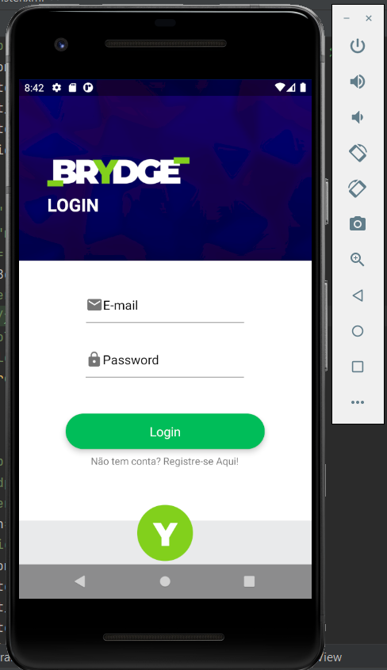
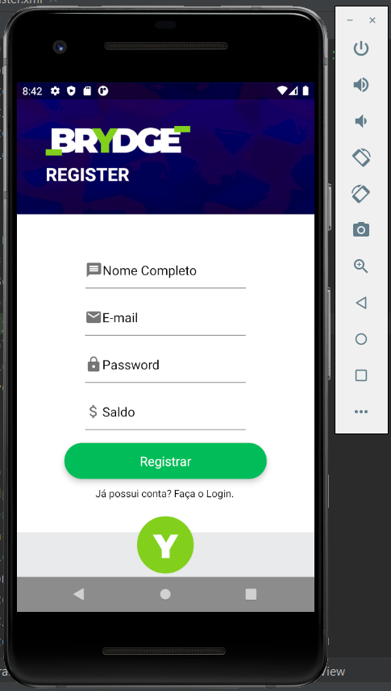
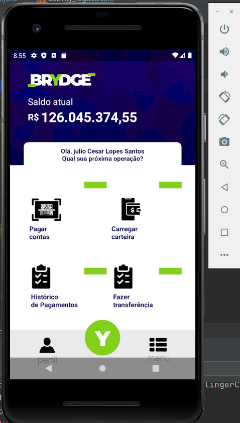

# vollup-app-android

This app is a native **Android** App made as a job for further avaliation from [Vollup](https://www.vollup.com/).
It was developed using [Android Studio](https://developer.android.com/studio?hl=pt&gclid=CjwKCAjw3riIBhAwEiwAzD3TiWGMLwJfHW4meMvGt4mY-y4UFzd1YzDHvJ6nReMEw04JFntq2vSJ0BoCyfgQAvD_BwE&gclsrc=aw.ds) with ```Java```.

The objective is:
1. Create in ```Firebase``` a database with the following fields:

- id.
- user.
- name.
- password.
- balance.

2. Create a ```login``` screen (front and back) connecting with Firebase.

3. Create the front and back from the indicated ```page``` with the following functionalities:

- Show the account balance.
- Show the name from the logged user.

PSD with ```page```: https://we.tl/t-MBVLkPPgsB
Also in 'brydge_tela.psd' in files above.

made by:
Julio Cesar Lopes Santos

## First Steps
1. First download [Android Studio](https://developer.android.com/studio?hl=pt&gclid=CjwKCAjw3riIBhAwEiwAzD3TiWGMLwJfHW4meMvGt4mY-y4UFzd1YzDHvJ6nReMEw04JFntq2vSJ0BoCyfgQAvD_BwE&gclsrc=aw.ds), and all of it's contents.
2. After Android Studio download and installation, create a project, choosing the **API version**, ```Java``` or ```Kotlin``` for language and name.
- Note: Never forget to create the project in **Github repository** so it's easier to commit changes and keep tracking versions.
3. In project, check if all ***SDK files*** are updated.

## Developing Workflow
Some users start the App development from the back-end, others from front-end.
I personally prefer always start from front-end. From my experience during my work as App Dev at UFBA, I think that it's easier to start from front-end because: 
- It's easier to view all the app's functionalities and promote changes.
- It's easier to reuse variables and structure the back-end with proper efficency.

In this project we already have the app design that contains 3 screens, ```login```, ```register account``` and ```page```.

With that in mind, the work-flow is going to be:

1. front-end (login, register and page)
2. Install ```Firebase``` and it's features to the project.
3. back-end
4. Testing
5. Insert app in Google Play.

## Front End.
- During front creation, it's important to keep in mind that there are many different phones, with different sizes, so it's really important to make a responsible layout. Nothing worse than floating elements to spoil the user experience.
- Make sure that everything the design has requested is in the layout.
- Make sure everything is in place.
- Avoid using absolute meajures, it's much more cleaner to use ```Relative Layouts```.

This is the resulted layout:
</br>
<p align="center">



</p>

## Firebase
There are many features in the ```Firebase``` platform that allows to develop quickly several cloud functionalities.
In our case, we are goint to use ***Firebase Authentication*** to manage the login and register system.
And ***Firebase Realtime Database*** to store and sync data with this cloud-hosted NoSQL database. Data is synced across all clients in realtime and remains available when the app goes offline.


## Back-End

### Register
Durign it's programming we are going to:
1. Define the layout element variables.
2. Program the Inputs to receive the right formatted data.
3. Set up ***Firebase Authentication***
4. Set up ***Firebase Realtime Database*** to receive user data.

### Login
Durign it's programming we are going to:
1. Define the layout element variables.
2. Program the Inputs to receive the right formatted data.
3. Authenticate user with ***Firebase Authentication***.
4. Set up and manage a log in and log out session. 
5. With ```Shared Preferences``` set up a persistant session, to keep logged even after closing app.

### Page
Durign it's programming we are going to:
1. Define the layout element variables.
2. Program the Inputs to receive the right formatted data.
3. Get and display data from ***Firebase Realtime Database***.

## Congratulations
Following these steps I developed a basic system app. It was a great experience and surely helped with my Android Development skills.
It was a great honor !